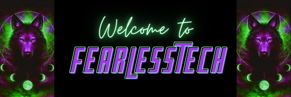

  
  
## 🤗 Welcome to our **Open Source** community! Please, follow us! 🤗

We welcome and are **OPEN TO ALL**, including UI/UX designers, developers, testers, and beyond to participate in creating social impact products. **Our goal** is to be inclusive to the largest number of contributors, with the most varied and diverse backgrounds possible. As such, we are committed to providing a [friendly, safe and welcoming environment to all from everywhere in the World](https://opensource.com/article/21/8/beginner-open-source-community).

You are inviteted to join us in our discussions! Feel free to [#Pitch a Project](https://github.com/orgs/FearlessTech/discussions/3) or [Request Membership](https://github.com/orgs/FearlessTech/discussions/4) to FearlessTech. You could just stop in to say Hi! Please make sure to follow our [Code of Conduct](https://github.com/anitab-org/anitab-org.github.io/blob/develop/docs/code_of_conduct.md). All of our Public Respositorys are open source and you are more then welcome  to join in on the build in anyway you would like. If you would like to help program, just comment on the issue (if there is not an issue, feel free to make one). If you would like to learn/teach, just ask or answer a question. If you would to improve our UI|UX or security, shout out from a discussion. 

### ✨ How you can contribute

* **Review** our projects’ pull requests.
* **Test** our deployed apps or pull requests and reports bugs you find.
    * Here’s our quality assurance guide.
* Help maintainers **triage** and improve our issues descriptions.
    * Confirm and improve our bug reports.
* **Help others** contribute by answering their questions and participate on GitHub.
* Improve and create new **documentation* pages. 
* **Write automated tests** to help us with code coverage.
* Improve our **automation processes** and CI/CD pipeline.
* Suggest **design** improvements for our apps.
* Read [our publications on Medium](https://medium.com/@Shashwat_Agrawal)

Check out our [Available issues](https://github.com/search?q=org%3Afearlesstech+is%3Aopen+label%3A%22Status%3A+Available%22&type=issues)!

## Co-Owner Information

:four_leaf_clover: Hi! I'm 4-Leafs-Code and a Jr Full Stack Developer. Click here to view my [profile](https://github.com/4-Leafs-Code) and I'll advise you to check out my [BookMarks Repo](https://github.com/4-Leafs-Code/MyBookMarks).

:: Hi! I'm Ronnie018 and a Jr WebDev. Click here to view my [profile](https://github.com/Ronnie018) and I'll advise you to check out my .

:: Hi! I'm ashwaryy and a {...}. Click here to view my [profile](https://github.com/ashwaryy) and I'll advise you to check out my .

:: Hi! I'm ShashwatAgrawal20 and I'm a passionate developer & Ethical hacker. Click here to view my [profile](https://github.com/ShashwatAgrawal20) and I'll advise you to check out my .
